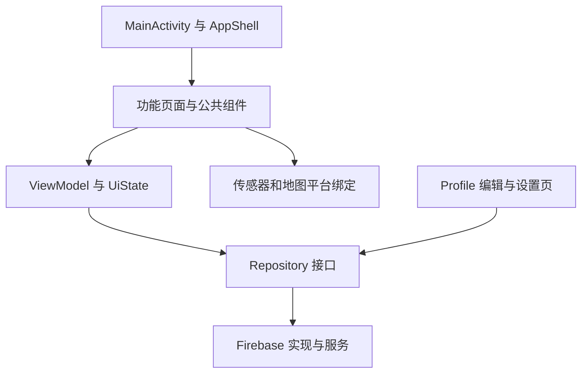

# 前端与 UI 文件清单及架构评审

检查日期：2026-10-11。范围是当前 `frontend-design` 工作区，包含已完成的页面拆分和 Room Plaza 样例房间删除。

## 总体判断

当前是一个按功能组织的单模块 Jetpack Compose Android 客户端。页面、ViewModel、Repository 和 Firebase 实现大体有清楚的分工；Map、Rooms、Profile 的目录拆分已改善查找和多人维护的体验。主要剩余问题是地图的页面状态与输入仍然复杂、共享模型的归属不够中立，以及部分异步动作和依赖创建仍在页面里。

本次直接检查文件分布、关键页面、状态重置、Repository 创建及跨包 import；这是静态架构评审。文中的风险是源码推断，未作为已复现的运行故障报告。本次只新增评审文档，没有修改应用逻辑。

## 文件范围与实际数据流

主 Kotlin 根目录：`app/src/main/kotlin/com/comp90018/app/`。文件清单在后文按模块逐项列出，包含当前未提交的新文件。

- 主源码中的页面、公共组件、功能状态、规则和触觉反馈共 **139 个 Kotlin 文件**；其中 **70 个文件包含 `@Composable`**，**18 个文件以 `ViewModel.kt` 结尾**。
- 与 UI 行为相邻的数据、硬件、情境引擎、诊断层另有 **74 个 Kotlin 文件**；全部主 Kotlin 源码共 **213 个文件**。
- Debug/Release 专用 Kotlin 文件共 **4 个**。Room Plaza 的两份 `RoomPreviewFixtures.kt` 已删除。
- Android 图片、字体、样式等资源共 **44 个文件**；测试源码为 **63 个 JVM 文件和 11 个设备测试文件**。这些是文件数，不是测试用例数。

大多数页面采用下面的数据流：

Profile 的保存和设置更新仍直接调用 Repository；部分 Screen 同时创建 Firebase Repository 与 ViewModel。组件提取不等于这两个职责也已经分离。

## 按模块评价

| 模块 | 当前做得好的地方 | 还需要注意什么 |
| --- | --- | --- |
| 应用入口、主题、底部导航 | 主题和导航独立；登录会话有自己的 ViewModelStore，退出或换账号时清理 | `AppShell.kt` 同时组装多个数据源、导航请求、组队状态、定位与触觉，协调责任较多 |
| Auth | 页面与 ViewModel 分离，规模很小 | 保持现有形态即可 |
| Friends / Chat | 主页面、请求、搜索、资料、聊天分文件；共享头像与输入组件 | 多个 Screen 接收 Firestore 并创建具体 Repository，纯 UI 隔离测试需要更多装配 |
| Map | route/components/rendering/compass/team/detail/sensors/debug 职责容易找到；镜头、标记、导航线已有独立实现 | 页面协调仍复杂；32 个入口参数、38 个 hunt context 字段、29 个 explorer context 字段；状态依赖分支优先级 |
| 独立导航 `features/navigation` | 到达确认、方向、定位可用性、能量与视觉规则多为独立纯函数 | 与 Map 相互引用；通用地图渲染和地图页面业务没有完全分开 |
| Rooms | 入口、广场、聊天、成员、任务、设置职责清楚；广场现在读取真实公开房间 | AppShell 和聊天页各有房间 ViewModel；房间切换时需要明确订阅生命周期；仍保留独立演示入口 |
| Profile | 概览、编辑、表单、设置、保存动作已分文件；头像已成为公共组件 | 表单、saving/error 和设置失败回滚仍由 Composable 本地状态协调，生命周期测试较难 |
| Treasure | 目录与收藏 ViewModel 分开，图像有本地回退 | `TreasureRemoteImage.kt` 同时处理请求、缓存、资源映射、绘制；Map 与 Treasure 相互依赖 |
| TreasureChallenge | ViewModel、挑战规则、视觉信号、照片过渡、各宝物绘图已有分工 | 主页面仍协调动画、权限和发现过渡；`QuestArtwork.kt` 可按绘图主题继续拆，但当前绘图循环有明确用途 |
| Haptics | 事件、策略、驱动、保存反馈边界清楚，已有较多测试 | 部分反馈策略直接依赖 Map/Rooms 类型；共享模型中立后会更容易复用 |
| 公共 UI / 图片 | 头像、聊天输入、错误展示和贴纸可以复用，文件较短 | 头像和宝物图片加载策略不一致；头像加载没有显式超时和共享缓存 |

## 优先改进的地方与证据

### 1. 地图状态与输入边界：优先级高

证据：[MapScreen.kt](../app/src/main/kotlin/com/comp90018/app/features/map/MapScreen.kt)、[MapNavigationState.kt](../app/src/main/kotlin/com/comp90018/app/features/map/route/MapNavigationState.kt)、[MapHuntContent.kt](../app/src/main/kotlin/com/comp90018/app/features/map/route/MapHuntContent.kt)、[MapExplorerContent.kt](../app/src/main/kotlin/com/comp90018/app/features/map/components/MapExplorerContent.kt)、[GoogleMapView.kt](../app/src/main/kotlin/com/comp90018/app/features/map/rendering/GoogleMapView.kt)。

`MapScreen` 仍有 32 个参数，`GoogleMapView` 有 30 个参数；两个 context 对象分别有 38 和 29 个字段。context 让文件边界清楚，但调用双方仍共享很多内部概念。导航类持有 11 个 MutableState，多个全屏页面选择可以同时非空，实际显示由 `MapHuntContent` 的判断顺序决定。

建议把互斥的全屏页面选择归入明确的 `MapRoute` 类型，把队伍输入、定位输入、地图呈现输入和动作分别建模。地图标记选中、独立调试状态和 Atlas 最终领取动画应保留各自生命周期；不能直接把所有状态合成一个枚举。先补关键页面切换回归，再逐步改变状态表示。

### 2. 房间和收藏状态的重复实例及作用域：优先级高

证据：[AppShell.kt](../app/src/main/kotlin/com/comp90018/app/AppShell.kt)、[TeamRoomChatScreen.kt](../app/src/main/kotlin/com/comp90018/app/features/rooms/chat/TeamRoomChatScreen.kt)、[DirectChatScreen.kt](../app/src/main/kotlin/com/comp90018/app/features/chat/DirectChatScreen.kt)、[TeamRoomChatViewModel.kt](../app/src/main/kotlin/com/comp90018/app/features/rooms/TeamRoomChatViewModel.kt)、[AuthSessionViewModel.kt](../app/src/main/kotlin/com/comp90018/app/AuthSessionViewModel.kt)。

AppShell 使用 `active_room_hunt_...`，房间页面使用 `team_room_...`，会为同一房间创建两份 TeamRoomChatViewModel。每份都观察房间和消息。收藏状态也分别使用 `treasure_collection_...`、`room_treasures_...`、`direct_chat_treasures_...` 三组 key。

这些 ViewModel 由登录会话的共享 Store 持有；房间订阅在 `onCleared()` 才取消，离开聊天页只是更新可见标志。切换房间后，旧 key 的实例可能继续留在登录会话内。建议先验证切换房间的订阅数，再确定跨页面共享状态、聊天页专属状态和 roomId 变化时的清理边界。这里没有据此声称网络请求或费用已经增加。

### 3. 共享业务模型的归属：优先级中高

证据：[MapRelic.kt](../app/src/main/kotlin/com/comp90018/app/features/map/MapRelic.kt)、[UserProfile.kt](../app/src/main/kotlin/com/comp90018/app/features/profile/UserProfile.kt)、[TreasureRepository.kt](../app/src/main/kotlin/com/comp90018/app/data/treasure/TreasureRepository.kt)、[ProfileRepository.kt](../app/src/main/kotlin/com/comp90018/app/data/profile/ProfileRepository.kt)。

宝物模型被 Map、Treasure、Rooms、挑战及数据层共同使用，却位于 `features/map`；资料模型被数据层和其他页面共同使用，却位于 `features/profile`。数据层因此 import 了 feature 包中的模型。包级 import 还存在 Map 与 Treasure、Map 与 TreasureChallenge、Map 与 Navigation 的相互引用；当前单模块能编译，但这些功能难以独立维护。

建议先把共享模型移到中立的 domain/model 目录，保留名称和行为，逐步把公共地图渲染及图片展示与具体页面分离。这里的相互引用是包依赖，不是 Gradle 模块循环。

### 4. 页面内的异步状态与恢复策略：优先级中

证据：[EditProfileScreen.kt](../app/src/main/kotlin/com/comp90018/app/features/profile/edit/EditProfileScreen.kt)、[ProfileSaveActions.kt](../app/src/main/kotlin/com/comp90018/app/features/profile/edit/ProfileSaveActions.kt)、[ProfileSettingsScreen.kt](../app/src/main/kotlin/com/comp90018/app/features/profile/settings/ProfileSettingsScreen.kt)、[AppShell.kt](../app/src/main/kotlin/com/comp90018/app/AppShell.kt)。

Profile 的表单、保存状态、错误和设置更新回滚仍由页面 `remember` 值和回调管理。顶部导航、Profile 子页和 Map 的许多选择也使用普通 `remember`；会话 ViewModel 可以跨 Activity 重建保留，但这些页面本地状态没有同样的恢复边界。Friends 列表页签和相机打开状态已局部采用 `rememberSaveable`。

建议为需要跨页面/配置变化保留的表单和操作建立状态持有者或 ViewModel，简单 UI 选择再按需求使用可保存状态。修改资料保存时必须保留当前读取时机：性别与简介在头像上传结束后读取，用户名与 extras 在点击保存时确定。已有回归测试覆盖这个区别。

### 5. 图片加载策略：优先级中

证据：[AvatarImageLoader.kt](../app/src/main/kotlin/com/comp90018/app/ui/images/AvatarImageLoader.kt)、[TreasureRemoteImage.kt](../app/src/main/kotlin/com/comp90018/app/features/treasure/TreasureRemoteImage.kt)。

头像加载已离开布局文件，位于 IO 线程并关闭输入流，这是好的边界；但 HTTPS 请求仍调用 `URL.openStream()`，没有显式连接/读取超时或共享缓存。宝物图片另有 10 秒超时和最多 12 项缓存。不同列表和页面的重复头像读取、失败回退及图片大小控制没有统一策略。

建议先统一接口、缓存/超时/回退规则，再决定是否替换实现；替换时分别验证 content URI、HTTPS、离线和失败场景。

### 6. 演示入口与维护文档：优先级中低

证据：[RoomsScreen.kt](../app/src/main/kotlin/com/comp90018/app/features/rooms/RoomsScreen.kt)、[DemoRoomScreen.kt](../app/src/main/kotlin/com/comp90018/app/features/rooms/demo/DemoRoomScreen.kt)、[ARCHITECTURE.md](../ARCHITECTURE.md)。

Room Plaza 的 10 个本地样例及开关已删除；另一个通过房间 ID `CAMPUS-2026` 进入的独立演示页面仍在 `src/main`，没有 Debug 限制。它是上次按行为保留要求留下的入口，不能当成广场样例仍未删除。

架构概述中还有与源码不完全一致的表述，例如 Friends 合并 starter contacts、以及把所有寻宝入口统一解释成一套距离/方向/水平条件。当前源码会过滤旧演示联系人，且各宝物有各自校准配置。建议后续更新说明，并明确决定独立演示入口的用途。

## 文件长度与拆分尺度

目前界面和功能呈现范围中最长的文件是 `QuestArtwork.kt`（549 行），其次是 `MapScreen.kt`（446 行）、`TreasureCompassGate.kt`（440 行）、`MapHuntContent.kt`（407 行）。没有原来 MapScreen 那样数千行的单个 UI 文件。

`QuestArtwork.kt` 包含背景、多个宝物绘图和绘图辅助；继续按湖泊、化石、温室、留声机等主题拆分会便于多人修改。它与 Wilson/South Lawn 的重复绘制循环大多用于花瓣、叶片、刻纹和装饰。团队位置的长期循环受前台生命周期控制、带延时并在 finally 中取消订阅。不能单凭循环或行数判断代码应删除。

建议下一轮先处理共享状态作用域和 Map 页面状态，再移动中立模型；绘图文件按实际修改频率拆分。现有规模可以继续使用单个 Android 模块，不需要为了目录整齐先增加多模块构建。

## 全部页面、组件和功能状态文件（139 个）

表中行数包括 import、注释和空行，用于定位维护规模；它不是复杂度评分。每项链接都指向当前文件。

### 应用入口、主题和全局状态：5 个文件

位置：`根目录/`。

| 文件 | 职责 | 行数 |
| --- | --- | ---: |
| [AppShell.kt](../app/src/main/kotlin/com/comp90018/app/AppShell.kt) | 底部页面、共享数据与跨功能协调 | 291 |
| [AppShellViewModel.kt](../app/src/main/kotlin/com/comp90018/app/AppShellViewModel.kt) | 当前用户资料状态 | 81 |
| [AppTheme.kt](../app/src/main/kotlin/com/comp90018/app/AppTheme.kt) | 颜色、字体与 Material 主题 | 74 |
| [AuthSessionViewModel.kt](../app/src/main/kotlin/com/comp90018/app/AuthSessionViewModel.kt) | 登录会话的 ViewModel Store 与清理 | 36 |
| [MainActivity.kt](../app/src/main/kotlin/com/comp90018/app/MainActivity.kt) | 应用与登录会话入口 | 80 |

### 底部导航：1 个文件

位置：`navigation/`。

| 文件 | 职责 | 行数 |
| --- | --- | ---: |
| [AppNavigation.kt](../app/src/main/kotlin/com/comp90018/app/navigation/AppNavigation.kt) | 底部页签、徽标及点击反馈 | 96 |

### 登录与注册：2 个文件

位置：`features/auth/`。

| 文件 | 职责 | 行数 |
| --- | --- | ---: |
| [AuthScreen.kt](../app/src/main/kotlin/com/comp90018/app/features/auth/AuthScreen.kt) | 页面、组件、绘图或 Compose 状态绑定 | 75 |
| [AuthViewModel.kt](../app/src/main/kotlin/com/comp90018/app/features/auth/AuthViewModel.kt) | 功能状态、事件与 Repository 协调 | 37 |

### 好友、请求、搜索与资料：10 个文件

位置：`features/friends/`。

| 文件 | 职责 | 行数 |
| --- | --- | ---: |
| [FriendFinder.kt](../app/src/main/kotlin/com/comp90018/app/features/friends/FriendFinder.kt) | 好友搜索界面 | 257 |
| [FriendFinderViewModel.kt](../app/src/main/kotlin/com/comp90018/app/features/friends/FriendFinderViewModel.kt) | 功能状态、事件与 Repository 协调 | 135 |
| [FriendLabels.kt](../app/src/main/kotlin/com/comp90018/app/features/friends/FriendLabels.kt) | 好友显示文字及旧演示联系人识别 | 21 |
| [FriendProfileScreen.kt](../app/src/main/kotlin/com/comp90018/app/features/friends/FriendProfileScreen.kt) | 好友资料界面 | 58 |
| [FriendProfileViewModel.kt](../app/src/main/kotlin/com/comp90018/app/features/friends/FriendProfileViewModel.kt) | 功能状态、事件与 Repository 协调 | 54 |
| [FriendRequestsContent.kt](../app/src/main/kotlin/com/comp90018/app/features/friends/FriendRequestsContent.kt) | 请求列表及请求详情 | 180 |
| [FriendsHomeContent.kt](../app/src/main/kotlin/com/comp90018/app/features/friends/FriendsHomeContent.kt) | Chats / Contacts 页面与列表 | 273 |
| [FriendsScreen.kt](../app/src/main/kotlin/com/comp90018/app/features/friends/FriendsScreen.kt) | 好友页面、请求、资料和私聊路由 | 140 |
| [FriendsViewModel.kt](../app/src/main/kotlin/com/comp90018/app/features/friends/FriendsViewModel.kt) | 功能状态、事件与 Repository 协调 | 142 |
| [UnreadMessagesViewModel.kt](../app/src/main/kotlin/com/comp90018/app/features/friends/UnreadMessagesViewModel.kt) | 功能状态、事件与 Repository 协调 | 40 |

### 私聊：2 个文件

位置：`features/chat/`。

| 文件 | 职责 | 行数 |
| --- | --- | ---: |
| [DirectChatScreen.kt](../app/src/main/kotlin/com/comp90018/app/features/chat/DirectChatScreen.kt) | 私聊消息、头像及输入界面 | 119 |
| [DirectChatViewModel.kt](../app/src/main/kotlin/com/comp90018/app/features/chat/DirectChatViewModel.kt) | 功能状态、事件与 Repository 协调 | 119 |

### 地图、组队寻宝、揭晓与故事：44 个文件

位置：`features/map/`。

| 文件 | 职责 | 行数 |
| --- | --- | ---: |
| [CompassGateConfig.kt](../app/src/main/kotlin/com/comp90018/app/features/map/CompassGateConfig.kt) | 罗盘条件及配置 | 17 |
| [DeviceEnvironment.kt](../app/src/main/kotlin/com/comp90018/app/features/map/DeviceEnvironment.kt) | 设备/模拟器环境策略 | 25 |
| [GuidingThreadGeometry.kt](../app/src/main/kotlin/com/comp90018/app/features/map/GuidingThreadGeometry.kt) | 导航线几何计算 | 48 |
| [GuidingThreadUpdates.kt](../app/src/main/kotlin/com/comp90018/app/features/map/GuidingThreadUpdates.kt) | 导航线更新规则 | 28 |
| [HuntProximityStage.kt](../app/src/main/kotlin/com/comp90018/app/features/map/HuntProximityStage.kt) | 寻宝接近阶段判定 | 33 |
| [LocationActionPolicy.kt](../app/src/main/kotlin/com/comp90018/app/features/map/LocationActionPolicy.kt) | 可显示位置与可执行任务位置的规则 | 55 |
| [MapDiscoveryLogic.kt](../app/src/main/kotlin/com/comp90018/app/features/map/MapDiscoveryLogic.kt) | 距离、可见性和提示规则 | 104 |
| [MapDiscoverySave.kt](../app/src/main/kotlin/com/comp90018/app/features/map/MapDiscoverySave.kt) | 宝物保存回调边界 | 9 |
| [MapRelic.kt](../app/src/main/kotlin/com/comp90018/app/features/map/MapRelic.kt) | 跨页面共享宝物和队员题目模型 | 52 |
| [MapScreen.kt](../app/src/main/kotlin/com/comp90018/app/features/map/MapScreen.kt) | 地图输入、寻宝动作和页面协调 | 446 |
| [MemberHuntQuizViewModel.kt](../app/src/main/kotlin/com/comp90018/app/features/map/MemberHuntQuizViewModel.kt) | 队员问题、资格与提交状态 | 82 |
| [PostChallengeRevealScreen.kt](../app/src/main/kotlin/com/comp90018/app/features/map/PostChallengeRevealScreen.kt) | 任务结束后的揭晓与故事路由 | 126 |
| [PostChallengeRevealSession.kt](../app/src/main/kotlin/com/comp90018/app/features/map/PostChallengeRevealSession.kt) | 发现过渡、照片与保存状态的保留会话 | 54 |
| [SouthLawnAssemblyScreen.kt](../app/src/main/kotlin/com/comp90018/app/features/map/SouthLawnAssemblyScreen.kt) | 页面、组件、绘图或 Compose 状态绑定 | 130 |
| [SouthLawnFragmentHunt.kt](../app/src/main/kotlin/com/comp90018/app/features/map/SouthLawnFragmentHunt.kt) | South Lawn 碎片模型与规则 | 27 |
| [TeamHuntClaimPrompt.kt](../app/src/main/kotlin/com/comp90018/app/features/map/TeamHuntClaimPrompt.kt) | 每会话领取提示状态 | 15 |
| [TeamHuntLocationBinding.kt](../app/src/main/kotlin/com/comp90018/app/features/map/TeamHuntLocationBinding.kt) | 前台组队位置发布与订阅生命周期 | 92 |
| [TeamHuntLocationPolicy.kt](../app/src/main/kotlin/com/comp90018/app/features/map/TeamHuntLocationPolicy.kt) | 共享位置的发布/显示资格与有效期 | 46 |
| [TeamHuntTaskEligibility.kt](../app/src/main/kotlin/com/comp90018/app/features/map/TeamHuntTaskEligibility.kt) | 队员任务与领取资格 | 37 |
| [TreasureChallengeRouting.kt](../app/src/main/kotlin/com/comp90018/app/features/map/TreasureChallengeRouting.kt) | 宝物任务路由和配置解析边界 | 43 |
| [TreasureDiscoveryReveal.kt](../app/src/main/kotlin/com/comp90018/app/features/map/TreasureDiscoveryReveal.kt) | 发现宝物及照片揭晓布局 | 198 |
| [TreasureStoryBook.kt](../app/src/main/kotlin/com/comp90018/app/features/map/TreasureStoryBook.kt) | 宝物故事呈现 | 229 |
| [UserLocationViewModel.kt](../app/src/main/kotlin/com/comp90018/app/features/map/UserLocationViewModel.kt) | 定位状态及前台刷新 | 60 |
| [compass/TreasureCompassGate.kt](../app/src/main/kotlin/com/comp90018/app/features/map/compass/TreasureCompassGate.kt) | 罗盘入口、条件灯及星星动画 | 440 |
| [components/LocationPermissionPrompt.kt](../app/src/main/kotlin/com/comp90018/app/features/map/components/LocationPermissionPrompt.kt) | 定位权限提示 | 60 |
| [components/MapControls.kt](../app/src/main/kotlin/com/comp90018/app/features/map/components/MapControls.kt) | 地图提示、视角和位置过期控件 | 149 |
| [components/MapExplorerContent.kt](../app/src/main/kotlin/com/comp90018/app/features/map/components/MapExplorerContent.kt) | 普通地图主布局和本地呈现状态 | 281 |
| [components/MapTextFormatting.kt](../app/src/main/kotlin/com/comp90018/app/features/map/components/MapTextFormatting.kt) | 地图距离与角度文字格式 | 18 |
| [debug/MapDebugControls.kt](../app/src/main/kotlin/com/comp90018/app/features/map/debug/MapDebugControls.kt) | 挑战预览及距离/方向模拟控件 | 147 |
| [detail/HuntScannerArtwork.kt](../app/src/main/kotlin/com/comp90018/app/features/map/detail/HuntScannerArtwork.kt) | 页面、组件、绘图或 Compose 状态绑定 | 272 |
| [detail/LegacySensorHuntPanel.kt](../app/src/main/kotlin/com/comp90018/app/features/map/detail/LegacySensorHuntPanel.kt) | 保留的旧传感器任务及麦克风权限 | 200 |
| [detail/TreasureDetailScreen.kt](../app/src/main/kotlin/com/comp90018/app/features/map/detail/TreasureDetailScreen.kt) | 页面、组件、绘图或 Compose 状态绑定 | 192 |
| [detail/TreasureDetailsContent.kt](../app/src/main/kotlin/com/comp90018/app/features/map/detail/TreasureDetailsContent.kt) | 页面、组件、绘图或 Compose 状态绑定 | 238 |
| [detail/TreasureSearchPanel.kt](../app/src/main/kotlin/com/comp90018/app/features/map/detail/TreasureSearchPanel.kt) | 页面、组件、绘图或 Compose 状态绑定 | 39 |
| [rendering/GoogleMapView.kt](../app/src/main/kotlin/com/comp90018/app/features/map/rendering/GoogleMapView.kt) | Compose 与 Maps SDK 连接及地图生命周期 | 342 |
| [rendering/GuidingThreadRenderer.kt](../app/src/main/kotlin/com/comp90018/app/features/map/rendering/GuidingThreadRenderer.kt) | 导航线覆盖层及更新 | 94 |
| [rendering/MapCameraController.kt](../app/src/main/kotlin/com/comp90018/app/features/map/rendering/MapCameraController.kt) | 镜头取景、坐标转换与视角 | 135 |
| [rendering/MapMarkerRenderer.kt](../app/src/main/kotlin/com/comp90018/app/features/map/rendering/MapMarkerRenderer.kt) | 宝物、碎片、自己和队友标记 | 308 |
| [route/MapHuntContent.kt](../app/src/main/kotlin/com/comp90018/app/features/map/route/MapHuntContent.kt) | 全屏寻宝页面的优先顺序与回调 | 407 |
| [route/MapNavigationState.kt](../app/src/main/kotlin/com/comp90018/app/features/map/route/MapNavigationState.kt) | 页面选择与用户/会话重置边界 | 42 |
| [sensors/MapSensorBindings.kt](../app/src/main/kotlin/com/comp90018/app/features/map/sensors/MapSensorBindings.kt) | 方向/运动的 Compose 传感器绑定 | 82 |
| [team/FragmentHuntScreens.kt](../app/src/main/kotlin/com/comp90018/app/features/map/team/FragmentHuntScreens.kt) | 页面、组件、绘图或 Compose 状态绑定 | 182 |
| [team/MemberHuntQuizScreen.kt](../app/src/main/kotlin/com/comp90018/app/features/map/team/MemberHuntQuizScreen.kt) | 页面、组件、绘图或 Compose 状态绑定 | 85 |
| [team/TeamHuntDialogs.kt](../app/src/main/kotlin/com/comp90018/app/features/map/team/TeamHuntDialogs.kt) | 页面、组件、绘图或 Compose 状态绑定 | 106 |

### 前往宝物的独立导航：15 个文件

位置：`features/navigation/`。

| 文件 | 职责 | 行数 |
| --- | --- | ---: |
| [NavigationEnergy.kt](../app/src/main/kotlin/com/comp90018/app/features/navigation/NavigationEnergy.kt) | 导航能量计算 | 69 |
| [NavigationLocationReadiness.kt](../app/src/main/kotlin/com/comp90018/app/features/navigation/NavigationLocationReadiness.kt) | 导航定位可用性及提示 | 39 |
| [NavigationMapUpdateGate.kt](../app/src/main/kotlin/com/comp90018/app/features/navigation/NavigationMapUpdateGate.kt) | 导航地图更新条件 | 24 |
| [NavigationNorthReference.kt](../app/src/main/kotlin/com/comp90018/app/features/navigation/NavigationNorthReference.kt) | 磁北/真北与方位换算 | 46 |
| [NavigationOrientationBinding.kt](../app/src/main/kotlin/com/comp90018/app/features/navigation/NavigationOrientationBinding.kt) | 导航方向传感器 Compose 绑定 | 48 |
| [NavigationOrientationSession.kt](../app/src/main/kotlin/com/comp90018/app/features/navigation/NavigationOrientationSession.kt) | 导航方向传感器会话与生命周期 | 40 |
| [NavigationTargetRecovery.kt](../app/src/main/kotlin/com/comp90018/app/features/navigation/NavigationTargetRecovery.kt) | 导航目标失效处理 | 13 |
| [RelicArrivalConfirmation.kt](../app/src/main/kotlin/com/comp90018/app/features/navigation/RelicArrivalConfirmation.kt) | 到达证据及确认规则 | 68 |
| [RelicNavigationPanels.kt](../app/src/main/kotlin/com/comp90018/app/features/navigation/RelicNavigationPanels.kt) | 导航条件与方向面板 | 141 |
| [RelicNavigationScreen.kt](../app/src/main/kotlin/com/comp90018/app/features/navigation/RelicNavigationScreen.kt) | 单宝物导航、到达和动画协调 | 306 |
| [RelicNavigationSimulation.kt](../app/src/main/kotlin/com/comp90018/app/features/navigation/RelicNavigationSimulation.kt) | 导航距离模拟状态 | 25 |
| [RelicNavigationState.kt](../app/src/main/kotlin/com/comp90018/app/features/navigation/RelicNavigationState.kt) | 导航输入到 UiState 的推导 | 110 |
| [RelicResonancePresentation.kt](../app/src/main/kotlin/com/comp90018/app/features/navigation/RelicResonancePresentation.kt) | 导航共鸣呈现 | 39 |
| [ResonanceVisualStyle.kt](../app/src/main/kotlin/com/comp90018/app/features/navigation/ResonanceVisualStyle.kt) | 导航能量/状态的视觉样式 | 41 |
| [RosetteResonanceGauge.kt](../app/src/main/kotlin/com/comp90018/app/features/navigation/RosetteResonanceGauge.kt) | 导航共鸣仪表绘图 | 130 |

### 房间与房间广场：14 个文件

位置：`features/rooms/`。

| 文件 | 职责 | 行数 |
| --- | --- | ---: |
| [RoomMemberProfileViewModel.kt](../app/src/main/kotlin/com/comp90018/app/features/rooms/RoomMemberProfileViewModel.kt) | 功能状态、事件与 Repository 协调 | 100 |
| [RoomPlazaScreen.kt](../app/src/main/kotlin/com/comp90018/app/features/rooms/RoomPlazaScreen.kt) | 真实公开房间、房间徽章及加入确认 | 207 |
| [RoomsScreen.kt](../app/src/main/kotlin/com/comp90018/app/features/rooms/RoomsScreen.kt) | 房间入口、演示和活动房间选择 | 59 |
| [RoomsViewModel.kt](../app/src/main/kotlin/com/comp90018/app/features/rooms/RoomsViewModel.kt) | 功能状态、事件与 Repository 协调 | 113 |
| [TeamRoomChatViewModel.kt](../app/src/main/kotlin/com/comp90018/app/features/rooms/TeamRoomChatViewModel.kt) | 功能状态、事件与 Repository 协调 | 262 |
| [UnreadRoomMessagesViewModel.kt](../app/src/main/kotlin/com/comp90018/app/features/rooms/UnreadRoomMessagesViewModel.kt) | 功能状态、事件与 Repository 协调 | 38 |
| [chat/TeamRoomChatScreen.kt](../app/src/main/kotlin/com/comp90018/app/features/rooms/chat/TeamRoomChatScreen.kt) | 聊天、成员、任务和子页面协调 | 267 |
| [demo/DemoRoomScreen.kt](../app/src/main/kotlin/com/comp90018/app/features/rooms/demo/DemoRoomScreen.kt) | CAMPUS-2026 独立本地演示房间 | 83 |
| [entry/RoomEntryScreen.kt](../app/src/main/kotlin/com/comp90018/app/features/rooms/entry/RoomEntryScreen.kt) | 房间 ID、创建与广场入口 | 67 |
| [hunt/DestinationPickerDialog.kt](../app/src/main/kotlin/com/comp90018/app/features/rooms/hunt/DestinationPickerDialog.kt) | 组队任务目的地选择 | 48 |
| [hunt/RoomHuntControls.kt](../app/src/main/kotlin/com/comp90018/app/features/rooms/hunt/RoomHuntControls.kt) | 组队任务启动、完成及碎片进度 | 155 |
| [members/RoomMemberProfileScreen.kt](../app/src/main/kotlin/com/comp90018/app/features/rooms/members/RoomMemberProfileScreen.kt) | 成员资料、好友和私聊入口 | 82 |
| [settings/RoomDetailsDialog.kt](../app/src/main/kotlin/com/comp90018/app/features/rooms/settings/RoomDetailsDialog.kt) | 成员管理、退出和解散操作界面 | 134 |
| [settings/RoomSettingsForm.kt](../app/src/main/kotlin/com/comp90018/app/features/rooms/settings/RoomSettingsForm.kt) | 房间创建/编辑共用表单 | 51 |

### 个人资料与设置：7 个文件

位置：`features/profile/`。

| 文件 | 职责 | 行数 |
| --- | --- | ---: |
| [ProfileScreen.kt](../app/src/main/kotlin/com/comp90018/app/features/profile/ProfileScreen.kt) | 资料概览、编辑与设置页面选择 | 52 |
| [UserProfile.kt](../app/src/main/kotlin/com/comp90018/app/features/profile/UserProfile.kt) | 跨功能共享的用户资料、扩展与设置模型 | 33 |
| [edit/EditProfileScreen.kt](../app/src/main/kotlin/com/comp90018/app/features/profile/edit/EditProfileScreen.kt) | 资料表单和保存状态 | 121 |
| [edit/ProfileFormFields.kt](../app/src/main/kotlin/com/comp90018/app/features/profile/edit/ProfileFormFields.kt) | 输入框和性别选择 | 78 |
| [edit/ProfileSaveActions.kt](../app/src/main/kotlin/com/comp90018/app/features/profile/edit/ProfileSaveActions.kt) | 头像上传与资料保存顺序 | 31 |
| [overview/ProfileOverview.kt](../app/src/main/kotlin/com/comp90018/app/features/profile/overview/ProfileOverview.kt) | 资料概览及功能入口 | 105 |
| [settings/ProfileSettingsScreen.kt](../app/src/main/kotlin/com/comp90018/app/features/profile/settings/ProfileSettingsScreen.kt) | 设置更新、失败提示与回滚 | 64 |

### 宝物目录与收藏：5 个文件

位置：`features/treasure/`。

| 文件 | 职责 | 行数 |
| --- | --- | ---: |
| [TreasureCatalogViewModel.kt](../app/src/main/kotlin/com/comp90018/app/features/treasure/TreasureCatalogViewModel.kt) | 功能状态、事件与 Repository 协调 | 62 |
| [TreasureCollectionViewModel.kt](../app/src/main/kotlin/com/comp90018/app/features/treasure/TreasureCollectionViewModel.kt) | 功能状态、事件与 Repository 协调 | 80 |
| [TreasureNavigationEntry.kt](../app/src/main/kotlin/com/comp90018/app/features/treasure/TreasureNavigationEntry.kt) | 宝物页进入导航的规则 | 35 |
| [TreasureRemoteImage.kt](../app/src/main/kotlin/com/comp90018/app/features/treasure/TreasureRemoteImage.kt) | 远端图片、缓存、本地回退和绘图资源映射 | 120 |
| [TreasureScreen.kt](../app/src/main/kotlin/com/comp90018/app/features/treasure/TreasureScreen.kt) | 宝物列表、收藏及详情呈现 | 309 |

### 宝物任务、照片过渡与绘图：14 个文件

位置：`features/treasurechallenge/`。

| 文件 | 职责 | 行数 |
| --- | --- | ---: |
| [ChallengeDiscoverySave.kt](../app/src/main/kotlin/com/comp90018/app/features/treasurechallenge/ChallengeDiscoverySave.kt) | 任务完成后的保存状态与重试 | 48 |
| [ChallengeExperience.kt](../app/src/main/kotlin/com/comp90018/app/features/treasurechallenge/ChallengeExperience.kt) | 任务呈现与场景选择 | 116 |
| [ChallengeSimulationSession.kt](../app/src/main/kotlin/com/comp90018/app/features/treasurechallenge/ChallengeSimulationSession.kt) | 调试任务模拟接口 | 22 |
| [QuestArtwork.kt](../app/src/main/kotlin/com/comp90018/app/features/treasurechallenge/QuestArtwork.kt) | 多个宝物徽章、背景和绘图辅助 | 549 |
| [QuestFieldGuide.kt](../app/src/main/kotlin/com/comp90018/app/features/treasurechallenge/QuestFieldGuide.kt) | 可展开的玩法说明卷轴 | 172 |
| [QuestPhotoExperience.kt](../app/src/main/kotlin/com/comp90018/app/features/treasurechallenge/QuestPhotoExperience.kt) | CameraX 页面及拍照图像过渡 | 310 |
| [QuestPhotoStyle.kt](../app/src/main/kotlin/com/comp90018/app/features/treasurechallenge/QuestPhotoStyle.kt) | 拍照任务视觉样式 | 72 |
| [QuestRequirementStars.kt](../app/src/main/kotlin/com/comp90018/app/features/treasurechallenge/QuestRequirementStars.kt) | 任务星星/条件指示 | 125 |
| [QuestVisualSignals.kt](../app/src/main/kotlin/com/comp90018/app/features/treasurechallenge/QuestVisualSignals.kt) | 任务条件映射为视觉信号 | 101 |
| [SouthLawnArtwork.kt](../app/src/main/kotlin/com/comp90018/app/features/treasurechallenge/SouthLawnArtwork.kt) | Atlas、藤蔓与 South Lawn 绘图 | 275 |
| [TreasureChallengeScreen.kt](../app/src/main/kotlin/com/comp90018/app/features/treasurechallenge/TreasureChallengeScreen.kt) | 任务路由、权限、动画与发现过渡协调 | 392 |
| [TreasureChallengeViewModel.kt](../app/src/main/kotlin/com/comp90018/app/features/treasurechallenge/TreasureChallengeViewModel.kt) | 任务状态、引擎生命周期和完成动作 | 379 |
| [WilsonFieldDynamics.kt](../app/src/main/kotlin/com/comp90018/app/features/treasurechallenge/WilsonFieldDynamics.kt) | Wilson 动态几何与呈现规则 | 47 |
| [WilsonHallArtwork.kt](../app/src/main/kotlin/com/comp90018/app/features/treasurechallenge/WilsonHallArtwork.kt) | Wilson 花、水和指针绘图 | 364 |

### 触觉反馈与保存结果反馈：12 个文件

位置：`features/haptics/`。

| 文件 | 职责 | 行数 |
| --- | --- | ---: |
| [AndroidTreasureHapticDriver.kt](../app/src/main/kotlin/com/comp90018/app/features/haptics/AndroidTreasureHapticDriver.kt) | Android 振动适配 | 28 |
| [ConfirmedTeamClaimHaptics.kt](../app/src/main/kotlin/com/comp90018/app/features/haptics/ConfirmedTeamClaimHaptics.kt) | 组队领取确认后的反馈协调 | 57 |
| [SafeTreasureHapticDriver.kt](../app/src/main/kotlin/com/comp90018/app/features/haptics/SafeTreasureHapticDriver.kt) | 硬件不可用时的反馈边界 | 25 |
| [TreasureHapticAttempt.kt](../app/src/main/kotlin/com/comp90018/app/features/haptics/TreasureHapticAttempt.kt) | 一次反馈/领取尝试标识 | 13 |
| [TreasureHapticController.kt](../app/src/main/kotlin/com/comp90018/app/features/haptics/TreasureHapticController.kt) | 事件优先级与反馈控制 | 118 |
| [TreasureHapticEvent.kt](../app/src/main/kotlin/com/comp90018/app/features/haptics/TreasureHapticEvent.kt) | 触觉事件模型 | 17 |
| [TreasureHapticPattern.kt](../app/src/main/kotlin/com/comp90018/app/features/haptics/TreasureHapticPattern.kt) | 振动模式 | 25 |
| [TreasureHapticProximity.kt](../app/src/main/kotlin/com/comp90018/app/features/haptics/TreasureHapticProximity.kt) | 接近宝物的反馈资格 | 33 |
| [TreasureHapticSave.kt](../app/src/main/kotlin/com/comp90018/app/features/haptics/TreasureHapticSave.kt) | 保存与触觉反馈衔接 | 52 |
| [TreasureHapticSessionBinding.kt](../app/src/main/kotlin/com/comp90018/app/features/haptics/TreasureHapticSessionBinding.kt) | 偏好及前台生命周期绑定 | 35 |
| [TreasureHapticSessionViewModel.kt](../app/src/main/kotlin/com/comp90018/app/features/haptics/TreasureHapticSessionViewModel.kt) | 功能状态、事件与 Repository 协调 | 68 |
| [TreasureHapticTarget.kt](../app/src/main/kotlin/com/comp90018/app/features/haptics/TreasureHapticTarget.kt) | 触觉目标选择 | 26 |

### 公共组件与图片读取：8 个文件

位置：`ui/`。

| 文件 | 职责 | 行数 |
| --- | --- | ---: |
| [components/AppTextField.kt](../app/src/main/kotlin/com/comp90018/app/ui/components/AppTextField.kt) | 共享表单输入框 | 53 |
| [components/ChatComposer.kt](../app/src/main/kotlin/com/comp90018/app/ui/components/ChatComposer.kt) | 共享聊天输入与宝物贴纸选择 | 170 |
| [components/ChatTimestamp.kt](../app/src/main/kotlin/com/comp90018/app/ui/components/ChatTimestamp.kt) | 聊天时间文字格式 | 33 |
| [components/EmptyState.kt](../app/src/main/kotlin/com/comp90018/app/ui/components/EmptyState.kt) | 共享空态组件 | 33 |
| [components/ProfileAvatar.kt](../app/src/main/kotlin/com/comp90018/app/ui/components/ProfileAvatar.kt) | 共享头像布局与文字回退 | 32 |
| [components/SensorErrorHost.kt](../app/src/main/kotlin/com/comp90018/app/ui/components/SensorErrorHost.kt) | 全局传感器错误展示 | 37 |
| [components/TreasureStickerCatalog.kt](../app/src/main/kotlin/com/comp90018/app/ui/components/TreasureStickerCatalog.kt) | 贴纸资源映射及 UI | 30 |
| [images/AvatarImageLoader.kt](../app/src/main/kotlin/com/comp90018/app/ui/images/AvatarImageLoader.kt) | content URI / HTTPS 头像读取 | 23 |

## 相邻底层依赖文件（74 个）

以下文件影响 UI 数据、任务资格和设备反馈，通常不负责页面布局。

### 数据接口、模型和 Firebase 实现：23 个文件

| 文件 | 行数 |
| --- | ---: |
| [auth/AuthRepository.kt](../app/src/main/kotlin/com/comp90018/app/data/auth/AuthRepository.kt) | 7 |
| [auth/FirebaseAuthRepository.kt](../app/src/main/kotlin/com/comp90018/app/data/auth/FirebaseAuthRepository.kt) | 12 |
| [auth/FirebaseAuthService.kt](../app/src/main/kotlin/com/comp90018/app/data/auth/FirebaseAuthService.kt) | 191 |
| [chat/ChatModels.kt](../app/src/main/kotlin/com/comp90018/app/data/chat/ChatModels.kt) | 21 |
| [chat/ChatRepository.kt](../app/src/main/kotlin/com/comp90018/app/data/chat/ChatRepository.kt) | 28 |
| [chat/FirebaseChatImageStorage.kt](../app/src/main/kotlin/com/comp90018/app/data/chat/FirebaseChatImageStorage.kt) | 32 |
| [chat/FirebaseChatRepository.kt](../app/src/main/kotlin/com/comp90018/app/data/chat/FirebaseChatRepository.kt) | 54 |
| [chat/FirebaseDirectChatService.kt](../app/src/main/kotlin/com/comp90018/app/data/chat/FirebaseDirectChatService.kt) | 180 |
| [profile/FirebaseProfileRepository.kt](../app/src/main/kotlin/com/comp90018/app/data/profile/FirebaseProfileRepository.kt) | 147 |
| [profile/ProfileRepository.kt](../app/src/main/kotlin/com/comp90018/app/data/profile/ProfileRepository.kt) | 24 |
| [rooms/FirebaseTeamRoomRepository.kt](../app/src/main/kotlin/com/comp90018/app/data/rooms/FirebaseTeamRoomRepository.kt) | 90 |
| [rooms/FirebaseTeamRoomService.kt](../app/src/main/kotlin/com/comp90018/app/data/rooms/FirebaseTeamRoomService.kt) | 559 |
| [rooms/TeamHuntLocationRepository.kt](../app/src/main/kotlin/com/comp90018/app/data/rooms/TeamHuntLocationRepository.kt) | 72 |
| [rooms/TeamRoomModels.kt](../app/src/main/kotlin/com/comp90018/app/data/rooms/TeamRoomModels.kt) | 28 |
| [rooms/TeamRoomRepository.kt](../app/src/main/kotlin/com/comp90018/app/data/rooms/TeamRoomRepository.kt) | 39 |
| [social/FirebaseSocialRepository.kt](../app/src/main/kotlin/com/comp90018/app/data/social/FirebaseSocialRepository.kt) | 55 |
| [social/FirebaseSocialService.kt](../app/src/main/kotlin/com/comp90018/app/data/social/FirebaseSocialService.kt) | 505 |
| [social/SocialModels.kt](../app/src/main/kotlin/com/comp90018/app/data/social/SocialModels.kt) | 56 |
| [social/SocialRepository.kt](../app/src/main/kotlin/com/comp90018/app/data/social/SocialRepository.kt) | 26 |
| [treasure/FirebaseTreasureCollectionRepository.kt](../app/src/main/kotlin/com/comp90018/app/data/treasure/FirebaseTreasureCollectionRepository.kt) | 83 |
| [treasure/FirebaseTreasureRepository.kt](../app/src/main/kotlin/com/comp90018/app/data/treasure/FirebaseTreasureRepository.kt) | 182 |
| [treasure/TreasureCollectionRepository.kt](../app/src/main/kotlin/com/comp90018/app/data/treasure/TreasureCollectionRepository.kt) | 17 |
| [treasure/TreasureRepository.kt](../app/src/main/kotlin/com/comp90018/app/data/treasure/TreasureRepository.kt) | 11 |

### 设备硬件、定位与相机适配：39 个文件

| 文件 | 行数 |
| --- | ---: |
| [AttitudeProcessor.kt](../app/src/main/kotlin/com/comp90018/app/sensors/AttitudeProcessor.kt) | 22 |
| [DirectionProcessor.kt](../app/src/main/kotlin/com/comp90018/app/sensors/DirectionProcessor.kt) | 74 |
| [MotionStabilityProcessor.kt](../app/src/main/kotlin/com/comp90018/app/sensors/MotionStabilityProcessor.kt) | 92 |
| [RotationProcessor.kt](../app/src/main/kotlin/com/comp90018/app/sensors/RotationProcessor.kt) | 51 |
| [SensorConfig.kt](../app/src/main/kotlin/com/comp90018/app/sensors/SensorConfig.kt) | 45 |
| [SensorStates.kt](../app/src/main/kotlin/com/comp90018/app/sensors/SensorStates.kt) | 59 |
| [SoundLevelCalculator.kt](../app/src/main/kotlin/com/comp90018/app/sensors/SoundLevelCalculator.kt) | 22 |
| [address/AddressLookup.kt](../app/src/main/kotlin/com/comp90018/app/sensors/address/AddressLookup.kt) | 7 |
| [address/AddressResult.kt](../app/src/main/kotlin/com/comp90018/app/sensors/address/AddressResult.kt) | 13 |
| [address/AndroidAddressLookup.kt](../app/src/main/kotlin/com/comp90018/app/sensors/address/AndroidAddressLookup.kt) | 54 |
| [address/FakeAddressLookup.kt](../app/src/main/kotlin/com/comp90018/app/sensors/address/FakeAddressLookup.kt) | 9 |
| [audio/AndroidSoundLevelSensor.kt](../app/src/main/kotlin/com/comp90018/app/sensors/audio/AndroidSoundLevelSensor.kt) | 101 |
| [audio/AudioRecorder.kt](../app/src/main/kotlin/com/comp90018/app/sensors/audio/AudioRecorder.kt) | 13 |
| [audio/FakeSoundLevelSensor.kt](../app/src/main/kotlin/com/comp90018/app/sensors/audio/FakeSoundLevelSensor.kt) | 18 |
| [audio/MediaRecorderAudioRecorder.kt](../app/src/main/kotlin/com/comp90018/app/sensors/audio/MediaRecorderAudioRecorder.kt) | 84 |
| [audio/SoundLevelOutput.kt](../app/src/main/kotlin/com/comp90018/app/sensors/audio/SoundLevelOutput.kt) | 10 |
| [audio/SoundLevelSensor.kt](../app/src/main/kotlin/com/comp90018/app/sensors/audio/SoundLevelSensor.kt) | 11 |
| [camera/CameraCapture.kt](../app/src/main/kotlin/com/comp90018/app/sensors/camera/CameraCapture.kt) | 25 |
| [camera/CameraXCapture.kt](../app/src/main/kotlin/com/comp90018/app/sensors/camera/CameraXCapture.kt) | 93 |
| [camera/QrCodeAnalyzer.kt](../app/src/main/kotlin/com/comp90018/app/sensors/camera/QrCodeAnalyzer.kt) | 36 |
| [location/AndroidLocationSensor.kt](../app/src/main/kotlin/com/comp90018/app/sensors/location/AndroidLocationSensor.kt) | 305 |
| [location/FakeLocationSensor.kt](../app/src/main/kotlin/com/comp90018/app/sensors/location/FakeLocationSensor.kt) | 90 |
| [location/GeoCoordinate.kt](../app/src/main/kotlin/com/comp90018/app/sensors/location/GeoCoordinate.kt) | 6 |
| [location/LocationAvailabilityState.kt](../app/src/main/kotlin/com/comp90018/app/sensors/location/LocationAvailabilityState.kt) | 11 |
| [location/LocationCalculator.kt](../app/src/main/kotlin/com/comp90018/app/sensors/location/LocationCalculator.kt) | 155 |
| [location/LocationConfig.kt](../app/src/main/kotlin/com/comp90018/app/sensors/location/LocationConfig.kt) | 17 |
| [location/LocationOutput.kt](../app/src/main/kotlin/com/comp90018/app/sensors/location/LocationOutput.kt) | 20 |
| [location/LocationPermissionState.kt](../app/src/main/kotlin/com/comp90018/app/sensors/location/LocationPermissionState.kt) | 14 |
| [location/LocationReading.kt](../app/src/main/kotlin/com/comp90018/app/sensors/location/LocationReading.kt) | 7 |
| [location/LocationReadingFilter.kt](../app/src/main/kotlin/com/comp90018/app/sensors/location/LocationReadingFilter.kt) | 35 |
| [location/LocationSensor.kt](../app/src/main/kotlin/com/comp90018/app/sensors/location/LocationSensor.kt) | 21 |
| [location/ProximityState.kt](../app/src/main/kotlin/com/comp90018/app/sensors/location/ProximityState.kt) | 8 |
| [motion/AndroidMotionSensor.kt](../app/src/main/kotlin/com/comp90018/app/sensors/motion/AndroidMotionSensor.kt) | 48 |
| [motion/FakeMotionSensor.kt](../app/src/main/kotlin/com/comp90018/app/sensors/motion/FakeMotionSensor.kt) | 21 |
| [motion/MotionSensor.kt](../app/src/main/kotlin/com/comp90018/app/sensors/motion/MotionSensor.kt) | 12 |
| [orientation/AndroidOrientationSensor.kt](../app/src/main/kotlin/com/comp90018/app/sensors/orientation/AndroidOrientationSensor.kt) | 97 |
| [orientation/FakeOrientationSensor.kt](../app/src/main/kotlin/com/comp90018/app/sensors/orientation/FakeOrientationSensor.kt) | 33 |
| [orientation/OrientationOutput.kt](../app/src/main/kotlin/com/comp90018/app/sensors/orientation/OrientationOutput.kt) | 11 |
| [orientation/OrientationSensor.kt](../app/src/main/kotlin/com/comp90018/app/sensors/orientation/OrientationSensor.kt) | 13 |

### 任务情境与条件判定：9 个文件

| 文件 | 行数 |
| --- | ---: |
| [AndroidDeviceContextEngine.kt](../app/src/main/kotlin/com/comp90018/app/contextengine/AndroidDeviceContextEngine.kt) | 103 |
| [DeviceContextEngine.kt](../app/src/main/kotlin/com/comp90018/app/contextengine/DeviceContextEngine.kt) | 23 |
| [DeviceContextSnapshot.kt](../app/src/main/kotlin/com/comp90018/app/contextengine/DeviceContextSnapshot.kt) | 28 |
| [FakeDeviceContextEngine.kt](../app/src/main/kotlin/com/comp90018/app/contextengine/FakeDeviceContextEngine.kt) | 50 |
| [challenge/ChallengeConfigValidation.kt](../app/src/main/kotlin/com/comp90018/app/contextengine/challenge/ChallengeConfigValidation.kt) | 19 |
| [challenge/ChallengeModels.kt](../app/src/main/kotlin/com/comp90018/app/contextengine/challenge/ChallengeModels.kt) | 103 |
| [challenge/ChallengePoise.kt](../app/src/main/kotlin/com/comp90018/app/contextengine/challenge/ChallengePoise.kt) | 38 |
| [challenge/ChallengeRuleEvaluator.kt](../app/src/main/kotlin/com/comp90018/app/contextengine/challenge/ChallengeRuleEvaluator.kt) | 230 |
| [challenge/RelicChallengeConfigs.kt](../app/src/main/kotlin/com/comp90018/app/contextengine/challenge/RelicChallengeConfigs.kt) | 141 |

### 跨页面传感器错误事件：3 个文件

| 文件 | 行数 |
| --- | ---: |
| [SensorComponent.kt](../app/src/main/kotlin/com/comp90018/app/diagnostics/SensorComponent.kt) | 14 |
| [SensorErrorEvent.kt](../app/src/main/kotlin/com/comp90018/app/diagnostics/SensorErrorEvent.kt) | 12 |
| [SensorErrorReporter.kt](../app/src/main/kotlin/com/comp90018/app/diagnostics/SensorErrorReporter.kt) | 31 |

## Debug / Release 实现（4 个）

| 文件 | 用途 |
| --- | --- |
| [debug/kotlin/com/comp90018/app/features/map/DebugChallengeRelics.kt](../app/src/debug/kotlin/com/comp90018/app/features/map/DebugChallengeRelics.kt) | 挑战宝物预览目录 |
| [debug/kotlin/com/comp90018/app/features/treasurechallenge/ChallengeSimulationFactory.kt](../app/src/debug/kotlin/com/comp90018/app/features/treasurechallenge/ChallengeSimulationFactory.kt) | 挑战传感器模拟与调试控件 |
| [release/kotlin/com/comp90018/app/features/map/DebugChallengeRelics.kt](../app/src/release/kotlin/com/comp90018/app/features/map/DebugChallengeRelics.kt) | 挑战宝物预览目录的 Release 空实现 |
| [release/kotlin/com/comp90018/app/features/treasurechallenge/ChallengeSimulationFactory.kt](../app/src/release/kotlin/com/comp90018/app/features/treasurechallenge/ChallengeSimulationFactory.kt) | 挑战传感器模拟与调试控件的 Release 空实现 |

## UI 资源（44 个）

图片、字体及地图样式不是 Kotlin 页面，但修改视觉时经常需要一起修改。

### `res/drawable`：7 个文件

- [map_arrived_symbol.xml](../app/src/main/res/drawable/map_arrived_symbol.xml)
- [nav_friends_symbol.xml](../app/src/main/res/drawable/nav_friends_symbol.xml)
- [nav_map_symbol.xml](../app/src/main/res/drawable/nav_map_symbol.xml)
- [nav_profile_symbol.xml](../app/src/main/res/drawable/nav_profile_symbol.xml)
- [nav_rooms_symbol.xml](../app/src/main/res/drawable/nav_rooms_symbol.xml)
- [nav_treasure_symbol.xml](../app/src/main/res/drawable/nav_treasure_symbol.xml)
- [treasure_chest_symbol.xml](../app/src/main/res/drawable/treasure_chest_symbol.xml)

### `res/drawable-nodpi`：30 个文件

- [historical_grainger_tone_tool_1952.jpg](../app/src/main/res/drawable-nodpi/historical_grainger_tone_tool_1952.jpg)
- [historical_old_quad_fossil_1875.jpg](../app/src/main/res/drawable-nodpi/historical_old_quad_fossil_1875.jpg)
- [historical_south_lawn_atlas_1900.jpg](../app/src/main/res/drawable-nodpi/historical_south_lawn_atlas_1900.jpg)
- [historical_system_garden.jpg](../app/src/main/res/drawable-nodpi/historical_system_garden.jpg)
- [historical_union_lake_1936.jpg](../app/src/main/res/drawable-nodpi/historical_union_lake_1936.jpg)
- [historical_wilson_hall_fire_1952.jpg](../app/src/main/res/drawable-nodpi/historical_wilson_hall_fire_1952.jpg)
- [map_quest_available.png](../app/src/main/res/drawable-nodpi/map_quest_available.png)
- [map_quest_selected.png](../app/src/main/res/drawable-nodpi/map_quest_selected.png)
- [nav_friends_game.png](../app/src/main/res/drawable-nodpi/nav_friends_game.png)
- [nav_map_game.png](../app/src/main/res/drawable-nodpi/nav_map_game.png)
- [nav_profile_game.png](../app/src/main/res/drawable-nodpi/nav_profile_game.png)
- [nav_rooms_game.png](../app/src/main/res/drawable-nodpi/nav_rooms_game.png)
- [nav_treasure_game.png](../app/src/main/res/drawable-nodpi/nav_treasure_game.png)
- [treasure_atlas.png](../app/src/main/res/drawable-nodpi/treasure_atlas.png)
- [treasure_atlas_fragment_north_east.png](../app/src/main/res/drawable-nodpi/treasure_atlas_fragment_north_east.png)
- [treasure_atlas_fragment_north_west.png](../app/src/main/res/drawable-nodpi/treasure_atlas_fragment_north_west.png)
- [treasure_atlas_fragment_south_east.png](../app/src/main/res/drawable-nodpi/treasure_atlas_fragment_south_east.png)
- [treasure_atlas_fragment_south_west.png](../app/src/main/res/drawable-nodpi/treasure_atlas_fragment_south_west.png)
- [treasure_emoji_atlas.png](../app/src/main/res/drawable-nodpi/treasure_emoji_atlas.png)
- [treasure_emoji_fern.png](../app/src/main/res/drawable-nodpi/treasure_emoji_fern.png)
- [treasure_emoji_glasshouse.png](../app/src/main/res/drawable-nodpi/treasure_emoji_glasshouse.png)
- [treasure_emoji_postcard.png](../app/src/main/res/drawable-nodpi/treasure_emoji_postcard.png)
- [treasure_emoji_press.png](../app/src/main/res/drawable-nodpi/treasure_emoji_press.png)
- [treasure_emoji_rosette.png](../app/src/main/res/drawable-nodpi/treasure_emoji_rosette.png)
- [treasure_fern.png](../app/src/main/res/drawable-nodpi/treasure_fern.png)
- [treasure_glasshouse.png](../app/src/main/res/drawable-nodpi/treasure_glasshouse.png)
- [treasure_postcard.png](../app/src/main/res/drawable-nodpi/treasure_postcard.png)
- [treasure_press.png](../app/src/main/res/drawable-nodpi/treasure_press.png)
- [treasure_rosette.png](../app/src/main/res/drawable-nodpi/treasure_rosette.png)
- [treasure_unknown.png](../app/src/main/res/drawable-nodpi/treasure_unknown.png)

### `res/font`：4 个文件

- [fredoka_variable.ttf](../app/src/main/res/font/fredoka_variable.ttf)
- [nunito_bold.ttf](../app/src/main/res/font/nunito_bold.ttf)
- [nunito_variable.ttf](../app/src/main/res/font/nunito_variable.ttf)
- [unifraktur_cook_bold.ttf](../app/src/main/res/font/unifraktur_cook_bold.ttf)

### `res/raw`：2 个文件

- [historical_image_sources.json](../app/src/main/res/raw/historical_image_sources.json)
- [map_style_retro.json](../app/src/main/res/raw/map_style_retro.json)

### `res/values`：1 个文件

- [themes.xml](../app/src/main/res/values/themes.xml)

## UI 相关测试文件（74 个）

测试目录同时包含界面、状态/规则、反馈和硬件基础计算的回归检查。以下列的是全部现有测试源码，避免遗漏跨层行为测试。

### `test`：63 个文件

- [AppShellViewModelTest.kt](../app/src/test/kotlin/com/comp90018/app/AppShellViewModelTest.kt)
- [AuthSessionViewModelTest.kt](../app/src/test/kotlin/com/comp90018/app/AuthSessionViewModelTest.kt)
- [contextengine/challenge/ChallengeRuleEvaluatorTest.kt](../app/src/test/kotlin/com/comp90018/app/contextengine/challenge/ChallengeRuleEvaluatorTest.kt)
- [data/treasure/ChallengeCalibrationParsingTest.kt](../app/src/test/kotlin/com/comp90018/app/data/treasure/ChallengeCalibrationParsingTest.kt)
- [data/treasure/CompassGateConfigParsingTest.kt](../app/src/test/kotlin/com/comp90018/app/data/treasure/CompassGateConfigParsingTest.kt)
- [data/treasure/FragmentHuntConfigParsingTest.kt](../app/src/test/kotlin/com/comp90018/app/data/treasure/FragmentHuntConfigParsingTest.kt)
- [data/treasure/MemberQuizParsingTest.kt](../app/src/test/kotlin/com/comp90018/app/data/treasure/MemberQuizParsingTest.kt)
- [diagnostics/SensorErrorReporterTest.kt](../app/src/test/kotlin/com/comp90018/app/diagnostics/SensorErrorReporterTest.kt)
- [features/chat/DirectChatViewModelTest.kt](../app/src/test/kotlin/com/comp90018/app/features/chat/DirectChatViewModelTest.kt)
- [features/friends/SocialViewModelTest.kt](../app/src/test/kotlin/com/comp90018/app/features/friends/SocialViewModelTest.kt)
- [features/haptics/HapticCollectionIntegrationTest.kt](../app/src/test/kotlin/com/comp90018/app/features/haptics/HapticCollectionIntegrationTest.kt)
- [features/haptics/SafeTreasureHapticDriverTest.kt](../app/src/test/kotlin/com/comp90018/app/features/haptics/SafeTreasureHapticDriverTest.kt)
- [features/haptics/TeamClaimHapticIntegrationTest.kt](../app/src/test/kotlin/com/comp90018/app/features/haptics/TeamClaimHapticIntegrationTest.kt)
- [features/haptics/TreasureHapticControllerTest.kt](../app/src/test/kotlin/com/comp90018/app/features/haptics/TreasureHapticControllerTest.kt)
- [features/haptics/TreasureHapticLifecycleTest.kt](../app/src/test/kotlin/com/comp90018/app/features/haptics/TreasureHapticLifecycleTest.kt)
- [features/haptics/TreasureHapticPriorityTest.kt](../app/src/test/kotlin/com/comp90018/app/features/haptics/TreasureHapticPriorityTest.kt)
- [features/haptics/TreasureHapticProximityTest.kt](../app/src/test/kotlin/com/comp90018/app/features/haptics/TreasureHapticProximityTest.kt)
- [features/haptics/TreasureHapticSaveTest.kt](../app/src/test/kotlin/com/comp90018/app/features/haptics/TreasureHapticSaveTest.kt)
- [features/haptics/TreasureHapticSessionViewModelTest.kt](../app/src/test/kotlin/com/comp90018/app/features/haptics/TreasureHapticSessionViewModelTest.kt)
- [features/haptics/TreasureHapticTargetTest.kt](../app/src/test/kotlin/com/comp90018/app/features/haptics/TreasureHapticTargetTest.kt)
- [features/map/GuidingThreadGeometryTest.kt](../app/src/test/kotlin/com/comp90018/app/features/map/GuidingThreadGeometryTest.kt)
- [features/map/GuidingThreadUpdatesTest.kt](../app/src/test/kotlin/com/comp90018/app/features/map/GuidingThreadUpdatesTest.kt)
- [features/map/HuntProximityResolverTest.kt](../app/src/test/kotlin/com/comp90018/app/features/map/HuntProximityResolverTest.kt)
- [features/map/LocationActionPolicyTest.kt](../app/src/test/kotlin/com/comp90018/app/features/map/LocationActionPolicyTest.kt)
- [features/map/MapDiscoveryLogicTest.kt](../app/src/test/kotlin/com/comp90018/app/features/map/MapDiscoveryLogicTest.kt)
- [features/map/MapDiscoverySaveTest.kt](../app/src/test/kotlin/com/comp90018/app/features/map/MapDiscoverySaveTest.kt)
- [features/map/MapInitialCameraStrategyTest.kt](../app/src/test/kotlin/com/comp90018/app/features/map/MapInitialCameraStrategyTest.kt)
- [features/map/MemberHuntQuizViewModelTest.kt](../app/src/test/kotlin/com/comp90018/app/features/map/MemberHuntQuizViewModelTest.kt)
- [features/map/OracleStarProgressTest.kt](../app/src/test/kotlin/com/comp90018/app/features/map/OracleStarProgressTest.kt)
- [features/map/PostChallengeRevealSessionTest.kt](../app/src/test/kotlin/com/comp90018/app/features/map/PostChallengeRevealSessionTest.kt)
- [features/map/TeamHuntClaimPromptTest.kt](../app/src/test/kotlin/com/comp90018/app/features/map/TeamHuntClaimPromptTest.kt)
- [features/map/TeamHuntLocationPolicyTest.kt](../app/src/test/kotlin/com/comp90018/app/features/map/TeamHuntLocationPolicyTest.kt)
- [features/map/TeamHuntTaskEligibilityTest.kt](../app/src/test/kotlin/com/comp90018/app/features/map/TeamHuntTaskEligibilityTest.kt)
- [features/map/TreasureChallengeRoutingTest.kt](../app/src/test/kotlin/com/comp90018/app/features/map/TreasureChallengeRoutingTest.kt)
- [features/navigation/NavigationDirectionGuidanceTest.kt](../app/src/test/kotlin/com/comp90018/app/features/navigation/NavigationDirectionGuidanceTest.kt)
- [features/navigation/NavigationEnergyTest.kt](../app/src/test/kotlin/com/comp90018/app/features/navigation/NavigationEnergyTest.kt)
- [features/navigation/NavigationLifecyclePolicyTest.kt](../app/src/test/kotlin/com/comp90018/app/features/navigation/NavigationLifecyclePolicyTest.kt)
- [features/navigation/NavigationLocationReadinessTest.kt](../app/src/test/kotlin/com/comp90018/app/features/navigation/NavigationLocationReadinessTest.kt)
- [features/navigation/NavigationOrientationSessionTest.kt](../app/src/test/kotlin/com/comp90018/app/features/navigation/NavigationOrientationSessionTest.kt)
- [features/navigation/RelicArrivalConfirmationTest.kt](../app/src/test/kotlin/com/comp90018/app/features/navigation/RelicArrivalConfirmationTest.kt)
- [features/navigation/RelicArrivalPresentationTest.kt](../app/src/test/kotlin/com/comp90018/app/features/navigation/RelicArrivalPresentationTest.kt)
- [features/navigation/RelicNavigationStateTest.kt](../app/src/test/kotlin/com/comp90018/app/features/navigation/RelicNavigationStateTest.kt)
- [features/navigation/RelicNavigationUiStateTest.kt](../app/src/test/kotlin/com/comp90018/app/features/navigation/RelicNavigationUiStateTest.kt)
- [features/navigation/ResonanceVisualStyleTest.kt](../app/src/test/kotlin/com/comp90018/app/features/navigation/ResonanceVisualStyleTest.kt)
- [features/rooms/DebugFragmentUnlockTest.kt](../app/src/test/kotlin/com/comp90018/app/features/rooms/DebugFragmentUnlockTest.kt)
- [features/rooms/TeamHuntClaimConfirmationTest.kt](../app/src/test/kotlin/com/comp90018/app/features/rooms/TeamHuntClaimConfirmationTest.kt)
- [features/treasure/TreasureCollectionViewModelTest.kt](../app/src/test/kotlin/com/comp90018/app/features/treasure/TreasureCollectionViewModelTest.kt)
- [features/treasure/TreasureNavigationEntryTest.kt](../app/src/test/kotlin/com/comp90018/app/features/treasure/TreasureNavigationEntryTest.kt)
- [features/treasurechallenge/ChallengeDiscoverySaveTest.kt](../app/src/test/kotlin/com/comp90018/app/features/treasurechallenge/ChallengeDiscoverySaveTest.kt)
- [features/treasurechallenge/ChallengeHapticSaveRegressionTest.kt](../app/src/test/kotlin/com/comp90018/app/features/treasurechallenge/ChallengeHapticSaveRegressionTest.kt)
- [features/treasurechallenge/DebugChallengeSimulationTest.kt](../app/src/test/kotlin/com/comp90018/app/features/treasurechallenge/DebugChallengeSimulationTest.kt)
- [features/treasurechallenge/QuestVisualSignalsTest.kt](../app/src/test/kotlin/com/comp90018/app/features/treasurechallenge/QuestVisualSignalsTest.kt)
- [features/treasurechallenge/TreasureChallengeViewModelTest.kt](../app/src/test/kotlin/com/comp90018/app/features/treasurechallenge/TreasureChallengeViewModelTest.kt)
- [features/treasurechallenge/WilsonFieldDynamicsTest.kt](../app/src/test/kotlin/com/comp90018/app/features/treasurechallenge/WilsonFieldDynamicsTest.kt)
- [sensors/AttitudeProcessorTest.kt](../app/src/test/kotlin/com/comp90018/app/sensors/AttitudeProcessorTest.kt)
- [sensors/DirectionProcessorTest.kt](../app/src/test/kotlin/com/comp90018/app/sensors/DirectionProcessorTest.kt)
- [sensors/MotionStabilityProcessorTest.kt](../app/src/test/kotlin/com/comp90018/app/sensors/MotionStabilityProcessorTest.kt)
- [sensors/RotationProcessorTest.kt](../app/src/test/kotlin/com/comp90018/app/sensors/RotationProcessorTest.kt)
- [sensors/SoundLevelCalculatorTest.kt](../app/src/test/kotlin/com/comp90018/app/sensors/SoundLevelCalculatorTest.kt)
- [sensors/location/FakeLocationSensorTest.kt](../app/src/test/kotlin/com/comp90018/app/sensors/location/FakeLocationSensorTest.kt)
- [sensors/location/LocationCalculatorTest.kt](../app/src/test/kotlin/com/comp90018/app/sensors/location/LocationCalculatorTest.kt)
- [sensors/location/LocationReadingFilterTest.kt](../app/src/test/kotlin/com/comp90018/app/sensors/location/LocationReadingFilterTest.kt)
- [ui/components/ChatTimestampTest.kt](../app/src/test/kotlin/com/comp90018/app/ui/components/ChatTimestampTest.kt)

### `androidTest`：11 个文件

- [features/auth/AuthScreenTest.kt](../app/src/androidTest/kotlin/com/comp90018/app/features/auth/AuthScreenTest.kt)
- [features/haptics/HapticSessionBindingTest.kt](../app/src/androidTest/kotlin/com/comp90018/app/features/haptics/HapticSessionBindingTest.kt)
- [features/map/TreasureCompassGateUiTest.kt](../app/src/androidTest/kotlin/com/comp90018/app/features/map/TreasureCompassGateUiTest.kt)
- [features/map/route/MapNavigationStateUiTest.kt](../app/src/androidTest/kotlin/com/comp90018/app/features/map/route/MapNavigationStateUiTest.kt)
- [features/navigation/RelicNavigationPanelsUiTest.kt](../app/src/androidTest/kotlin/com/comp90018/app/features/navigation/RelicNavigationPanelsUiTest.kt)
- [features/profile/edit/ProfileSaveActionsTest.kt](../app/src/androidTest/kotlin/com/comp90018/app/features/profile/edit/ProfileSaveActionsTest.kt)
- [features/rooms/RoomClaimHapticUiTest.kt](../app/src/androidTest/kotlin/com/comp90018/app/features/rooms/RoomClaimHapticUiTest.kt)
- [features/treasurechallenge/QuestFieldGuideUiTest.kt](../app/src/androidTest/kotlin/com/comp90018/app/features/treasurechallenge/QuestFieldGuideUiTest.kt)
- [features/treasurechallenge/SystemGardenPhotoUiTest.kt](../app/src/androidTest/kotlin/com/comp90018/app/features/treasurechallenge/SystemGardenPhotoUiTest.kt)
- [features/treasurechallenge/TreasureChallengeUiTest.kt](../app/src/androidTest/kotlin/com/comp90018/app/features/treasurechallenge/TreasureChallengeUiTest.kt)
- [features/treasurechallenge/UnionLawnPhotoUiTest.kt](../app/src/androidTest/kotlin/com/comp90018/app/features/treasurechallenge/UnionLawnPhotoUiTest.kt)

## 运行和资源构建配置

以下文件负责 Android 入口、构建和系统要求；日常改布局通常不需要改动它们。

| 文件 | 职责 |
| --- | --- |
| [app/src/main/AndroidManifest.xml](../app/src/main/AndroidManifest.xml) | 应用入口、权限、Maps 配置入口 |
| [app/build.gradle.kts](../app/build.gradle.kts) | Android SDK、Compose、Firebase、相机与测试依赖 |
| [build.gradle.kts](../build.gradle.kts) | 插件版本 |
| [settings.gradle.kts](../settings.gradle.kts) | 单 app 模块和依赖仓库 |
| [gradle.properties](../gradle.properties) | Gradle / Android / Kotlin 构建选项 |
| [gradle/gradle-daemon-jvm.properties](../gradle/gradle-daemon-jvm.properties) | Gradle JVM 25 配置 |
| [gradle/wrapper/gradle-wrapper.properties](../gradle/wrapper/gradle-wrapper.properties) | Gradle Wrapper 版本 |
| [local.properties.sample](../local.properties.sample) | 本地 SDK 与 Maps 配置示例 |
